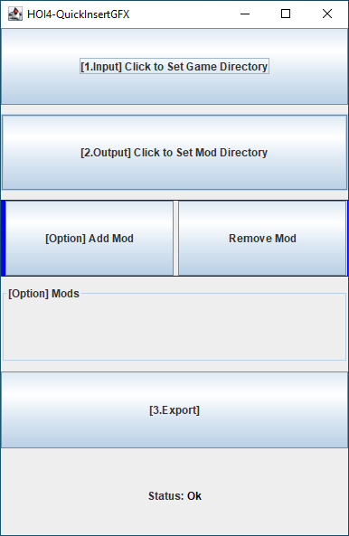

# HOI4-QuickInsertGFX
This program was created to work with [FocusTreeAndEventManager](https://github.com/pongmadee/FocusTreeAndEventManager) to help add mod's images file information to the mod's interface directory(eventpictures.gfx , goals.gfx , goals_shine.gfx). However, you can apply it to your mod without [FocusTreeAndEventManager tool](https://github.com/pongmadee/FocusTreeAndEventManager).

#### [Download the lastest release](https://github.com/pongmadee/HOI4-QuickInsertGFX/releases)

### How to use
| --- | Description |
| --- | --- |
|  | 1. Click to set game directory    2. Click to set mod directory   3. Click Export to create new *.gfx files in mod's interface directory.   |

### Concept : How does it work

### Used libraries
- ANTLR4 : A powerful parser generator. 
